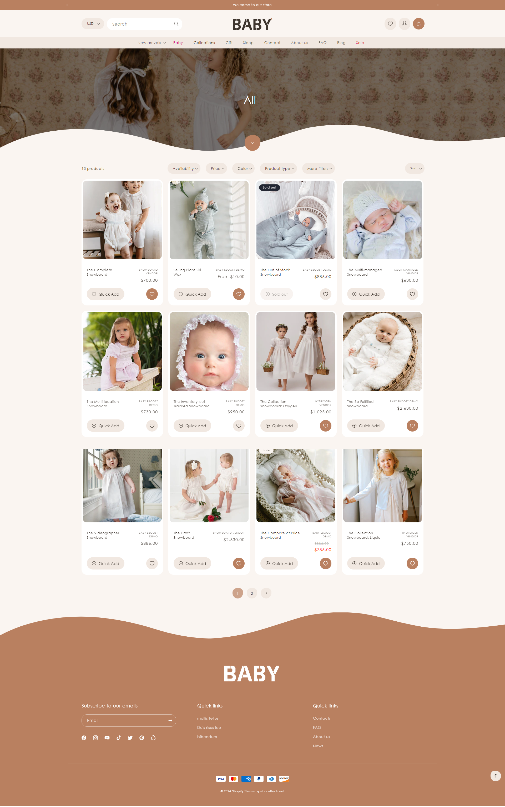
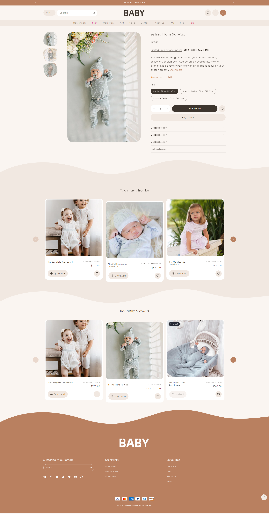
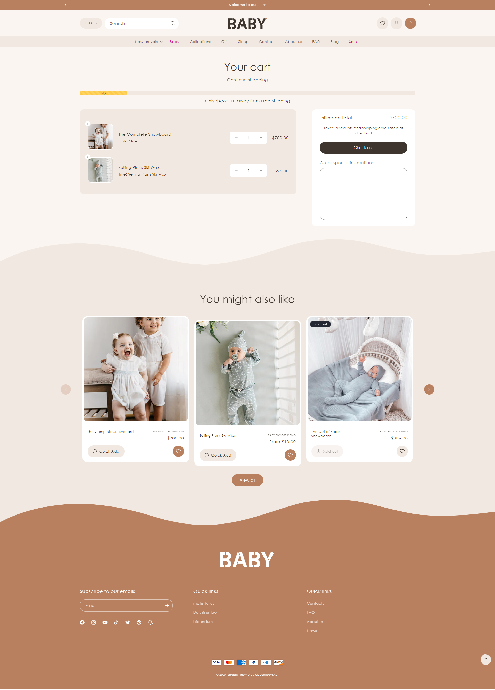

Demo: https://baby-eboost-demo.myshopify.com/

Password: 1234

# BABY SHOPIFY THEME

## STANDARD SECTIONS

+ Recently Viewed
+ Countdown
+ Free style
+ Products tabs
+ Instagram
+ Icon with text
+ Featured product
+ Featured collection
+ Video
+ Contact Form
+ Email signup
+ Newsletter popup
+ Collapsible content
+ Multirow
+ Multicolum
+ Collage
+ Slideshow
+ Image banner
+ Image with text
+ Rich text
+ Quick order list
+ Collection list
+ Blog posts
+ Announcement Bar

## USE SETTING MENU


### Add color for top level

1. Go to Online Store -> Themes -> Customize button
2. Sections -> Header  Sections -> Add block -> Color Menu

3. Select color -> Select url match url that you would like to show color


### Add color for 1 level

You only need add an image for collection after it will be shown here

### Add icon for 2 level

1. Go to Online Store -> Themes -> Customize button
2. Sections -> Header  Sections -> Add block -> Icon
3. Upload an icon 
4. Select url match url that you would like to show icon


## USE PROGRESS SHIPPING (both cart drawer and cart page)


1. Go to Online Store -> Themes -> Customize button
2. Settings -> Progress Bar Shipping -> check Enable Progress Bar shipping to turn on it
3. Add total price, messages for free shipping


## USE COUNTDOWN ON PRODUCT DETAIL PAGE

To enbable countdown on product detail page. We need follow step by step below:


1. Go to Online Store -> Themes -> Customize button -> Settings
2. Expand Product cards -> click Enable Countdown? to enable this featured


3. Select option 
	- Use for all products -> If you chose this option After that go to step 4 
	- Use for different product -> If you chose this option. After that go to step 5
4. Add a deal time with a format like "2025/12/25 22:11:00". This time must be greater than the current time.

5. Go to Content->Metaobjects-> Manage definitions


6. Go to Products -> click Add definition button on top right 


7. Create a metafield

```bash

Namespace: custom
Key: countdown

```


8. Go to  products -> Select product that you would like to show count down

9. Add a deal time for this product. This time must be greater than the current time.


## SETTING TO SHOW WISHLIST


1. Go to Online Store -> Themes -> Customize button -> Settings

2. Expand Product cards -> click "Enable Wishlist?" to show wishlist icon on card product and product detail page


3. Go to Sections -> Header section -> check "Enable Header Wishlist" 


3.  Go to Online Store -> Pages -> Create wishlist page

```bash

URL and handle: wish-list
Theme template: wishlist

```


## HOME PAGE


## COLLECTION PAGE



 
##  PRODUCT DETAIL PAGE

 


##  CART PAGE

 

## Bugs/Feature Requests & Contribution

Please do open a pull request on GitHub should you want to contribute, or create an issue.

## License
[BSD-4-Clause](http://directory.fsf.org/wiki/License:BSD_4Clause) - Do as you wish 👍 
